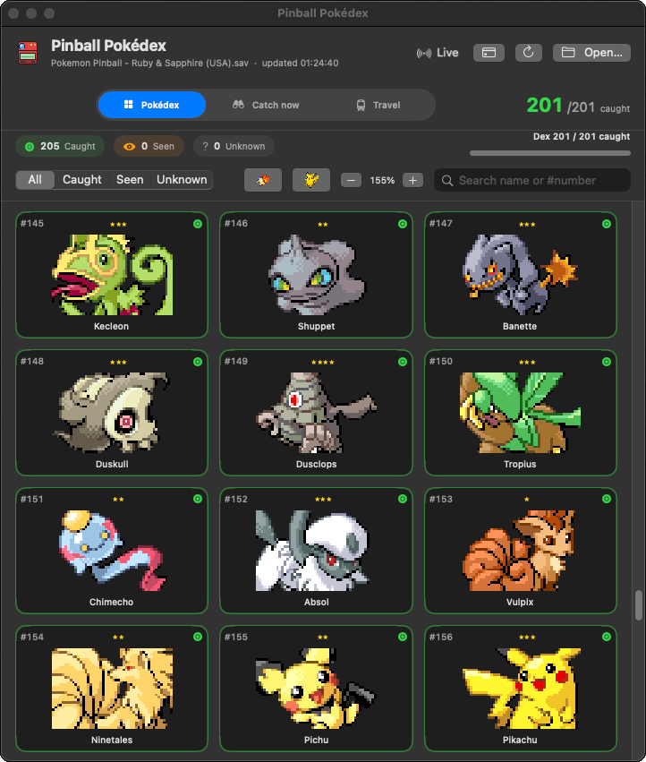

# Pinball Pokédex

A native macOS companion app for **Pokémon Pinball: Ruby & Sapphire** running in
[mGBA](https://mgba.io). It reads your save *and* your live game and answers the three
questions the game itself never does:

- **What have I got?** — your full 205-species Pokédex, updating in real time as you catch.
- **What can I catch right now?** — everything still uncaught **in the area you're currently in**,
  with how many are left, ranked by rarity.
- **Where do I go next?** — a live travel guide showing which area the left and right ramps
  take you to from where you are.

Plus an e-Reader bonus menu that toggles the five Japanese card bonuses directly in the running
game, and a save editor for the four bonus guests.

Nothing is required of the game itself — no ROM patching, no cheats file. The app reads memory
through a small Lua script that mGBA runs for you.

<p align="center">
  
</p>

## Features

**Live Pokédex.** All 205 species as caught (full colour), seen (grayscale) or unknown
(silhouette + `???`). Unknowns can be revealed individually, and each entry explains exactly how
to get it. Filter by state, search by name or `#number`, and track completion against the
in-game metric of 201 (the four bonus guests don't count).

**Catch now.** While you're playing, this lists what's still missing from your current area,
separating "catchable right now" from eggs and evolutions, and highlights anything you've caught
this game — including uncaught evolutions of a newly caught base form.

**Travel.** A map of the Ruby and Sapphire area loops that auto-detects which table you're on and
shows where each ramp leads.

**e-Reader bonuses.** Toggle all five card bonuses live: Special Guests, Encounter Rate Up, DX
Mode, Ruin Area and Bonus Stage. These live in RAM, so they reset when the game powers off.
There's also a **Force Special Mon** switch that guarantees the next Catch 'Em Mode is a special
spawn (Latios on Ruby / Latias on Sapphire while uncaught) — it drives `forceSpecialMons`, a flag
the ROM reads but never writes.

## Download

**[Download the latest release](https://github.com/JimmysDev/pinball-pokedex/releases/latest)** —
a universal build (Apple Silicon + Intel), macOS 13 or later. No build tools needed.

Unzip it, drag `PinballPokedex.app` to /Applications, then run this once:

```bash
xattr -dr com.apple.quarantine /Applications/PinballPokedex.app
```

That step is needed because the app is **ad-hoc signed rather than notarized** — notarizing
requires a paid Apple Developer account. macOS quarantines anything unnotarized you download and
will refuse to open it with a "cannot be verified" or "damaged" error until the flag is cleared.
It's not a comment on the app; every line of it is in this repo, and you can always build it
yourself instead.

Point the app at your `.sav` with **Open…** if it doesn't find it (it usually sits next to the
ROM, or in `~/Documents/Game Boy Advance/`).

## Build it yourself

Requires [xcodegen](https://github.com/yonaskolb/XcodeGen) (`brew install xcodegen`):

```bash
./build.sh && open PinballPokedex.app
```

`./scripts/release.sh v1.2.3` builds a universal app, verifies it really is universal, and
publishes it as a GitHub release.

## Connecting the live bridge

The save file alone only updates when the game writes it. For live area, catch tracking and the
e-Reader toggles, load the bridge script into mGBA:

1. Start your game in mGBA.
2. **Tools ▸ Scripting**.
3. Paste the line from the app's bridge menu (**Copy bridge script**) into the *Run* box and press
   Run. It looks like `dofile("…/PinballPokedex.app/Contents/Resources/mgba_bridge.lua")`.

The header chip turns green when it connects. **The script must be re-run every time you relaunch
mGBA, and after a Reset** — it lives in mGBA's memory, not your save. The app nags you about this
only when mGBA is actually running without it.

The bridge writes a JSON snapshot to `/tmp/pinball_pokedex_state.json` about four times a second,
and reads `/tmp/pinball_pokedex_cmd.json` for the toggles. The only bytes it ever writes to the
game are the five e-Reader flags and `forceSpecialMons`.

## How it works

Everything is derived from the [WhenGryphonsFly/pokepinballrs](https://github.com/WhenGryphonsFly/pokepinballrs)
decompilation (branch `clean`), which also documents the mechanics the guides get wrong.

**Save format.** 32 KB SRAM holds two redundant copies of `struct SaveData` (672 bytes): primary
at file offset `0x4`, backup at `0x2A4`. Each is validated by a 10-byte `POKEPINAGB` signature
(struct offset `0x264`) and a 16-bit folded checksum (all 16-bit LE words sum to `0xFFFF`).

`pokedexFlags[205]` is the first field (file offset `0x4`), one byte per species in pinball-dex
order — `0` Treecko … `200` Jirachi, `201–204` the guests. Values: `0` unseen, `1` seen, `2`
shared, `3` shared+seen, `4` caught.

**Live memory.** `gMain` at `0x0200B0C0` (selected field `+0x04`, `eReaderBonuses[5]` at `+0x07`),
the current game struct via the pointer at `0x020314E0` (area `+0x035`, `forceSpecialMons`
`+0x12B`, current species `+0x598`, catch target `+0x59A`, catches this game `+0x5F0`), and the
live dex straight out of SRAM at `0x0E000004`. The app cross-checks the live dex against the save
and ignores it unless it's consistent.

**Rare spawns.** Latios, Latias and the four guests are in no area table at all — they can only
come from one roll made when Catch 'Em Mode starts (`catch_hatch_picker.c`), which needs 100
caught in the dex *and* 5 caught in the current game, then lands 1-in-100 (1-in-50 with the
Encounter Rate Up card). Area and arrow lights make no difference, and beating Rayquaza sets
nothing.

## Layout

- `PinballPokedex/` — Swift sources (save parser, live bridge, views).
- `scripts/mgba_bridge.lua` — the mGBA Lua bridge (bundled into the app).
- `scripts/clean_portraits.py` — turns the raw ripped portraits into transparent sprites.
- `Resources/pokedex.json` — pinball order joined with National Dex numbers and catch methods.
- `project.yml` — xcodegen spec; `build.sh` regenerates the project and builds.

## Credits & legal

Save format and game mechanics from [WhenGryphonsFly/pokepinballrs](https://github.com/WhenGryphonsFly/pokepinballrs)
and [pret/pokepinballrs](https://github.com/pret/pokepinballrs). Catch methods cross-referenced
with community Pinball guides.

The app code is mine and free to use. The bundled sprites, dex portraits and e-Reader card artwork
are © Nintendo / Creatures / GAME FREAK, included here only so the app can identify Pokémon; they
aren't mine to license. No ROM or save data is distributed with this project.
